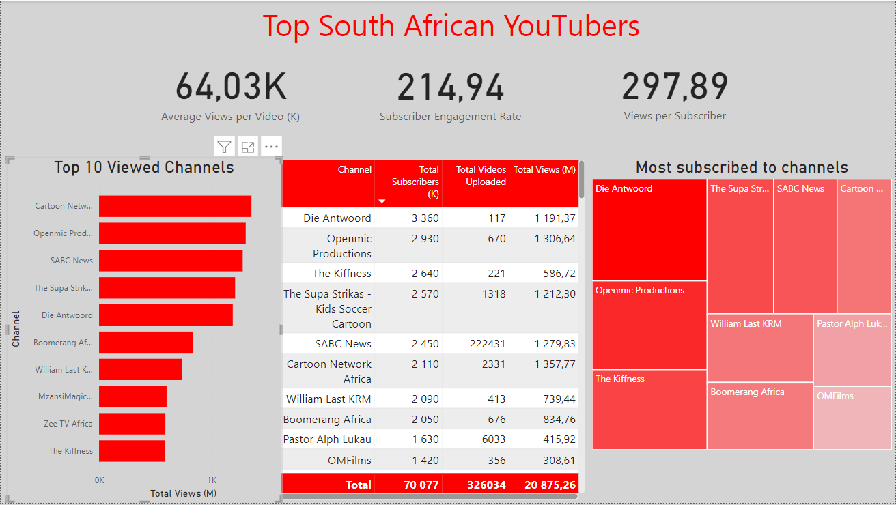

# South African YouTube Channels Analysis (2024)

## Cleaning and Transforming the Data

- The Name column was spilt into channel name and channel Id
- Retrieved subscribers, view total and video count from YouTube API

## PowerBI Analysis

- Dashboard published to [PowerBi](https://app.powerbi.com/groups/me/reports/de65ae5a-b6fe-476a-8c58-6938fcefe636/6720ad99258af1bf3eee?experience=power-bi)

- 

- For advertising and youtube marketing:

  - Die Antwoord has a high view count per video at 10,18 M which is expected for a music channel
  - Openmic Productions with average view count per video of 1,95 M and a subscriber engagement of 4370 subscribers per video would lead to a more successful campaign over The Supa Strikes with 919 K views per video and 1950 subscribers per video.
  - For direct youtube advertising (youtube placed advertisments during the video) average views per video are most important
  - For brand-deal advertising, views per subscriber and subscribers per video (subscriber engagement) become important in maximising reach.

- Conclusions
  In general depending on the marketing budget, comparisons can be made between different youtube channels with similar subsriber counts to determine which is likely to have a higher impact.
